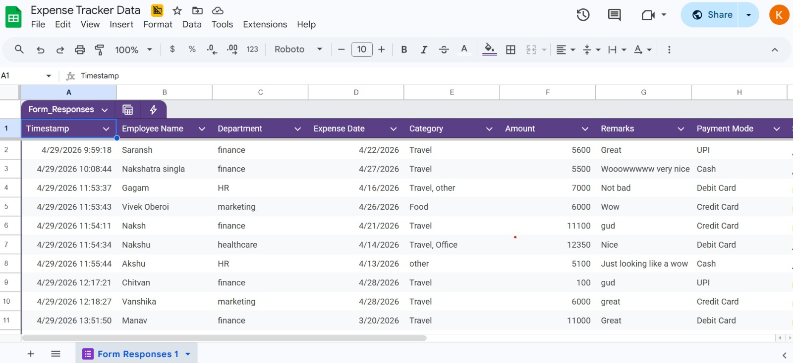
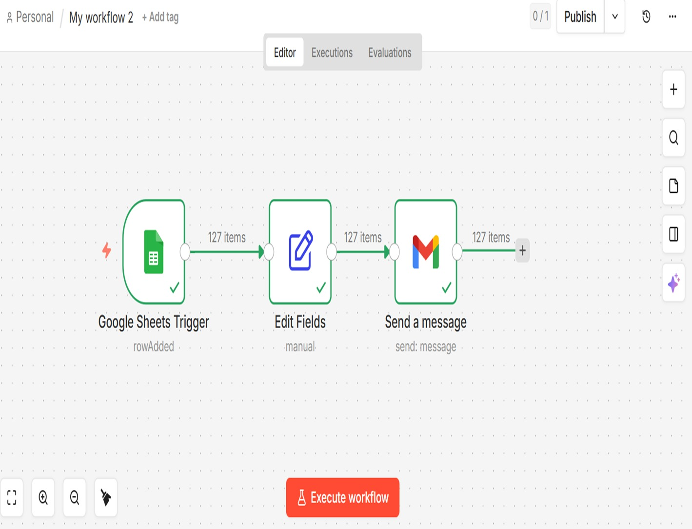

# 💰 AI Finance Expense Automation System

## 📌 Project Overview

This project demonstrates an end-to-end *automated expense management system* built using no-code tools and analytics platforms. It integrates Google Forms, Google Sheets, n8n workflow automation, and Power BI to create a *real-time financial tracking system*.

The solution eliminates manual work, reduces processing time, and provides instant visibility into expenses for better decision-making.

---

## 🚨 Business Problem

Traditional expense management systems rely heavily on:

* Manual data entry
* Email approvals
* Spreadsheet tracking
* Delayed reporting

### ❌ Challenges:

* High chances of errors
* Slow reimbursement process
* No real-time insights
* Inefficient financial control

---

## ✅ Solution

This system automates the complete workflow:

1. Employee submits expense via *Google Form*
2. Data is stored in *Google Sheets*
3. *n8n* automatically triggers workflow
4. Email notification sent to finance team
5. Data visualized in *Power BI Dashboard*

---

## 🛠️ Tools & Technologies

* Google Forms (Data Input)
* Google Sheets (Data Storage)
* n8n (Workflow Automation)
* Gmail (Email Notifications)
* Microsoft Power BI (Dashboard & Analytics)

---

## 🔄 Workflow Architecture

text
Google Form → Google Sheets → n8n Workflow → Email Notification → Power BI Dashboard

---

## 📁 Project Structure

text
Finance-Automation-Project/
│
├── n8n_workflow/
│   └── expense_automation_workflow.json
│
├── ppt/
│   └── expense_tracker_presentation.pptx
│
├── screenshots/
│   ├── form_view.png
│   ├── sheet_data.png
│   ├── workflow_diagram.png
│   └── email_notification.png

---

## 📸 Screenshots

### 1. Google Form Interface

---

### 2. Google Sheet Data Capture

---

### 3. n8n Workflow Architecture

---

### 4. Email Notification Output

---

## ⭐ Key Features

* Automated expense data capture
* Real-time workflow execution
* Instant email notifications
* Centralized expense tracking
* Dashboard-based insights

---

## 📊 Business Impact

* Reduced manual effort and errors
* Faster expense processing
* Improved transparency
* Real-time financial insights
* Better budgeting and control

---

## 🌍 Real-World Applications

* Corporate finance departments
* Startups automating operations
* Consulting firms
* Shared service centers

---

## ⚙️ How to Run the Project

1. Create a Google Form for expense submission
2. Link responses to Google Sheets
3. Build n8n workflow using Google Sheets trigger
4. Configure Gmail node for notifications
5. Connect dataset to Power BI for dashboard

---

## 🚀 Future Enhancements

* Approval workflow integration
* AI-based fraud detection
* Budget alerts & notifications
* Role-based dashboards
* ERP system integration

---

## 🏁 Conclusion

This project shows how automation and AI-driven workflows can transform traditional finance systems into *smart, real-time decision-making platforms*.

---

## 👩‍💼 Author

*Tripti Gupta*
MBA Finance Student | AI in Finance Practitioner

---
